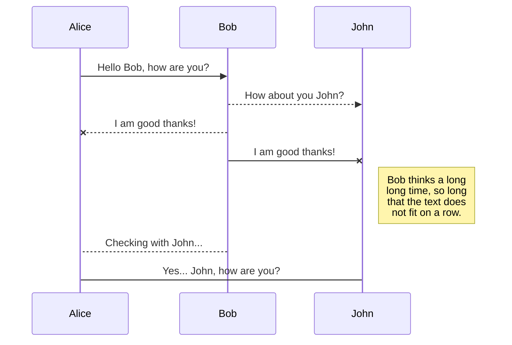
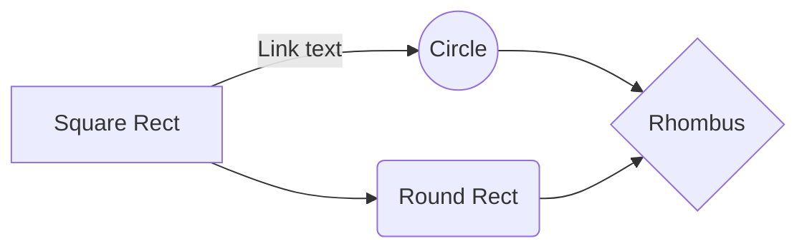

## UML diagrams

You can render UML diagrams using [Mermaid](https://mermaidjs.github.io/). For example, this will produce a sequence diagram:

And this will produce a flow chart:

## References
* [Criando Readme incríveis!](https://www.tuliocalil.com.br/post/untitled)
* [Markdown Here Cheatsheet](https://github.com/adam-p/markdown-here/wiki/Markdown-Here-Cheatsheet)
* [StackEdit](https://stackedit.io/app)
